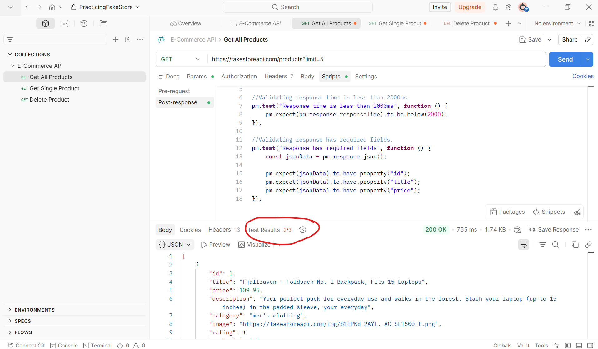
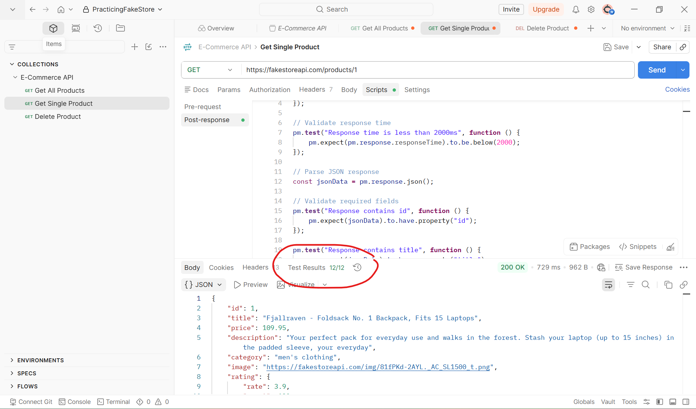
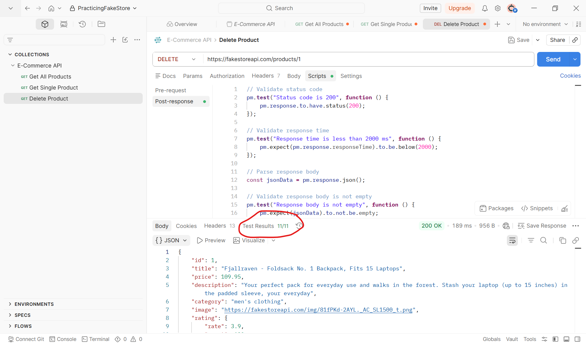

# 🚀 E-Commerce API Testing with Postman

## Project Overview

This project demonstrates REST API testing using Postman.

### API Tested

FakeStore API

https://fakestoreapi.com

---

## Tools Used

- Postman
- JavaScript
- GitHub

---

## Test Scenarios

### ✔ Get All Products

Method: GET

Validations:

- Status code = 200
- Response time < 2000 ms
- Response body contains required fields

---

### ✔ Get Single Product

Method: GET

Validations:

- Status code = 200
- id exists
- title exists
- price exists

---

### ✔ Delete Product

Method: DELETE

Validations:

- Status code = 200
- Response body returned

---

## Project Structure

```text
collections/
reports/
screenshots/
README.md
```

---

## Screenshots

### Get All Products



### Get Single Product



### Delete Product



---

## Future Improvements

- POST requests
- PUT requests
- PATCH requests
- Authentication
- Newman HTML reports
- GitHub Actions CI/CD
